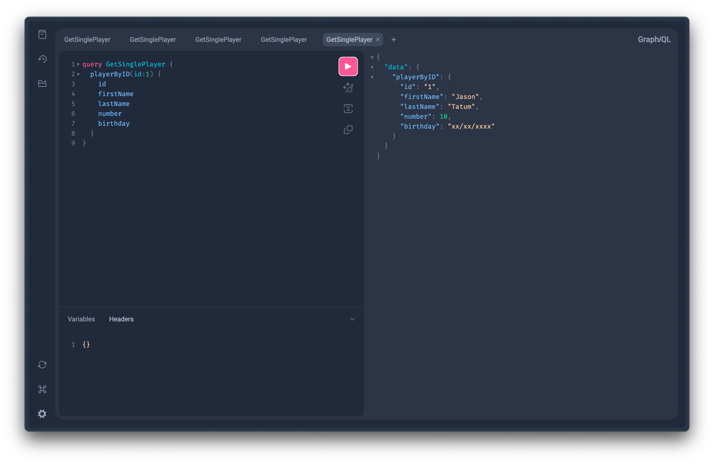
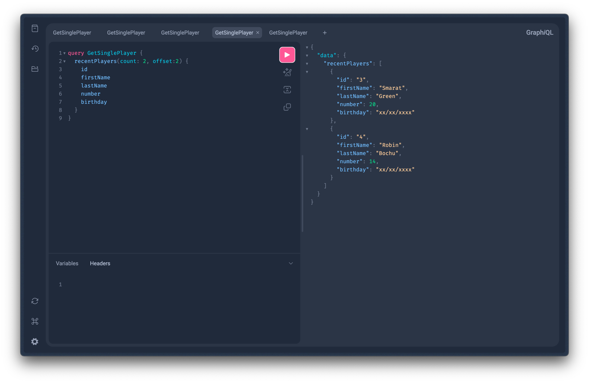
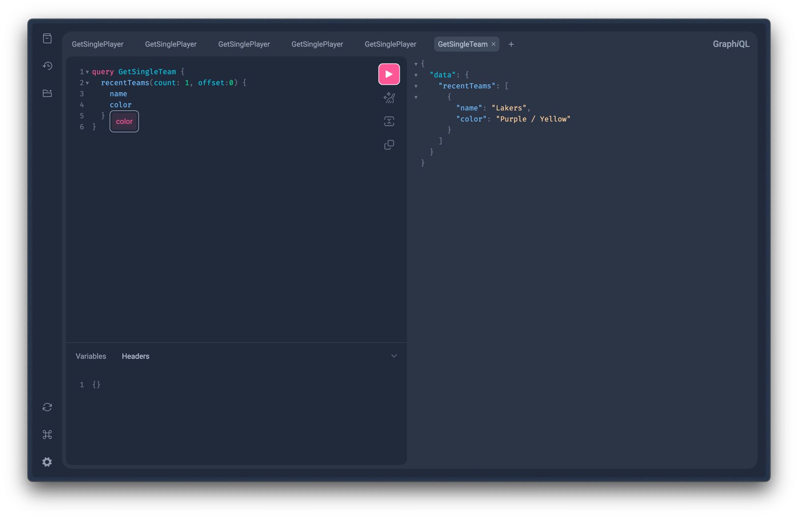
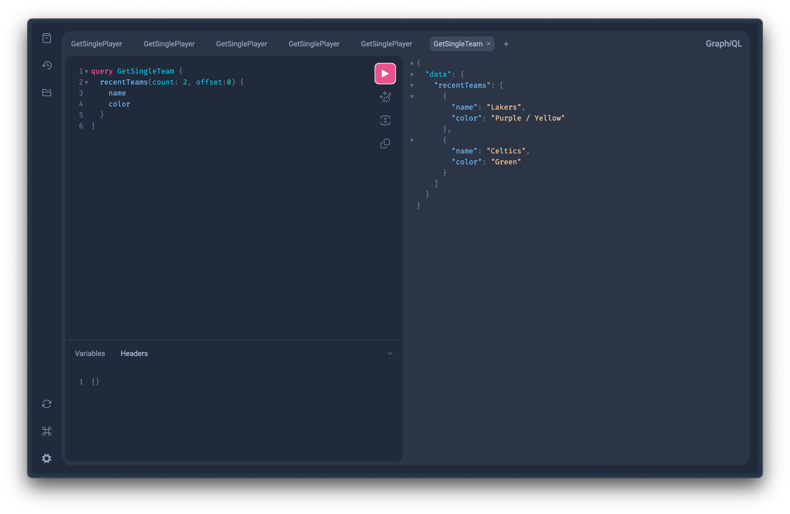

## Rendu GraphQL TSE

### Structure of the project 
``` raw
$ROOT
├── java
│   └── org
│       └── rygn
│           └── first_graphql
│               ├── FirstGraphqlApplication.java
│               ├── GraphqlConfiguration.java
│               ├── Player.java
│               ├── PlayerController.java
│               ├── PlayerDao.java
│               ├── Team.java
│               ├── TeamController.java
│               └── TeamDao.java
└── resources
    ├── application.properties
    └── graphql
        ├── ops.graphqls
        ├── player.graphqls
        └── team.graphqls
```


### Get a single player 


### Get players by offset and count 


### Get teams by offset and count


